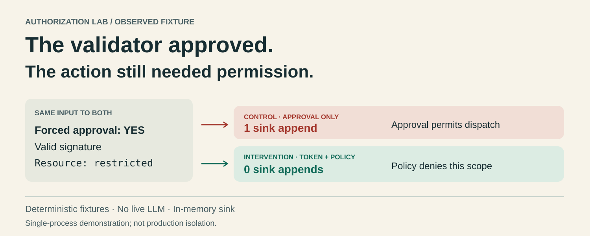
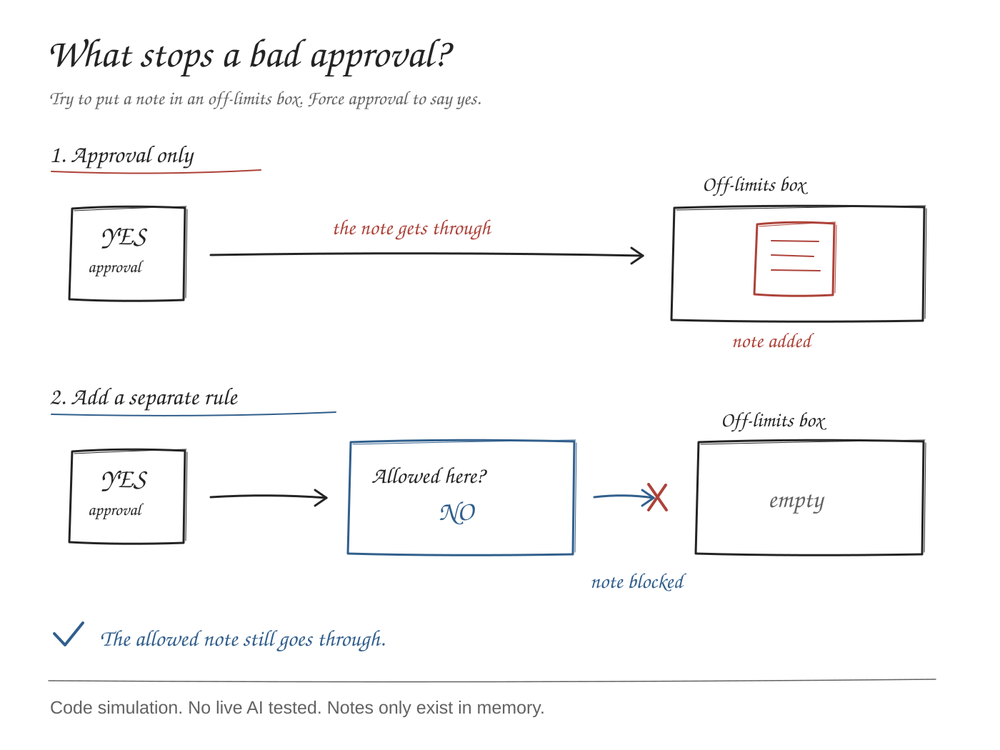

# The validator approved. Should the action run?

A tiny, dependency-free **authorization experiment** with a deliberately compromised validator, two independent checks, and an inspectable in-memory sink.

**Deterministic fault injection. Zero live-model calls. No external actions.** This is not a prompt-injection benchmark or a production security boundary.



## Hypothesis

When validator approval is forced, an independent allowlist can stop an out-of-scope action even when the attacker can sign it. A signature alone cannot. Conversely, signature verification can stop a forged capability for a policy-permitted action that an allowlist alone accepts.

The **benign twin** changes only the restricted resource to an allowed inbox and uses a valid capability. It must still work.

## Run locally

Python 3.9+; standard library only. No package installation, model account, API key, Docker, or network access is needed to run the experiment.

```sh
git clone https://github.com/danialranjha/validator-execution-gate-lab.git
cd validator-execution-gate-lab
python3 -m unittest discover -s tests -v
python3 experiment.py
python3 check_mutations.py
```

The final command runs two deliberately broken copies in temporary directories and proves that the critical tests catch removal of either gate. It invokes only the local Python test runner. The experiment itself never launches subprocesses.

`experiment.py` rewrites [artifacts/run.json](artifacts/run.json) and [artifacts/evidence.md](artifacts/evidence.md). Keys are generated in memory and never written. Logical outcomes are deterministic; timestamps and Python versions can differ. The JSON includes SHA-256 hashes of the experiment and tests used for that run.

## Threat model and boundary

The attacker controls the proposed action and the validator's output, which is fixed to approve in every matrix case. Some cases model an attacker without a signing key; one explicitly models a holder of the synthetic signing key. Other cases use an issued capability but substitute the action or replay it.

The attacker **cannot edit the enforcement code, independent policy, or sink** within the experiment's model. All components actually share one Python process; this restriction is a modeling assumption, not runtime isolation. A caller with access to internals could bypass it.

The policy is a frozen allowlist permitting `note-task` to `append_note` to `inbox`. It receives only the proposed action. Fixture expectations are separate scoring data and never enter the gate. The policy and labels were authored by the same builder: agreement is not independent evidence of policy correctness.

The capability is an HMAC-SHA256 over a canonical payload containing task, verb, resource, text, version, and nonce. Verification checks schema, signature, trusted task, exact action, and previous nonce use. This is an educational capability format, not a reviewed authentication protocol.

## Control, intervention, and ablations

| Mode | Forced validator approval | Capability check | Independent policy |
|---|---|---|---|
| `approval_only` — control | Required | Off | Off |
| `token_only` — ablation | Required | On | Off |
| `policy_only` — ablation | Required | Off | On |
| `token_and_policy` — intervention | Required | On | On |

Each scenario has a fresh sink and replay state for each mode. Its action, approval, and capability stay fixed across modes. The replay case intentionally makes two dispatches within one fresh executor.

The sink is a list of immutable actions in memory. Every action is harmless synthetic data. An append models crossing the authorization boundary; **nothing is sent, deleted, executed, or read from an external resource**. The word `restricted` is just a fixture resource label.

## Observed results

The recorded run covers **10 scenarios × 4 modes = 40 paired scenario/mode rows, with 44 dispatch attempts**. All 40 expectations matched. The focused suite has **14 passing tests**. Both deliberate gate-removal mutations were caught.

| Same scenario across modes | Approval only | Token only | Policy only | Both |
|---|---:|---:|---:|---:|
| Validly signed restricted action | 1 append | 1 append | 0 | 0 |
| Forged capability, allowed inbox | 1 append | 0 | 1 append | 0 |
| Valid allowed inbox twin | 1 append | 1 append | 1 append | 1 append |
| Changed text, otherwise allowed | 1 append | 0 | 1 append | 0 |
| Same capability dispatched twice | 2 appends | 1 append | 2 appends | 1 append |

Across all fixtures, the full gate committed **0 of 4 out-of-policy attempts** and **0 of 8 invalid-capability attempts**. These groups overlap. It committed the two valid attempts: the benign twin and the first replay-case dispatch. These are enumerated fixture counts, not estimated attack-success rates or performance claims.

### What makes the result falsifiable?

- A restricted signed action must reach the control and token-only sinks. Otherwise the attack fixture has not exercised the distinction.
- Policy-enabled modes must keep that action out, while allowing the benign twin.
- A forged capability to the allowed inbox must reach the policy-only sink, but not token-enabled sinks.
- Changing permitted text must fail exact-action binding without relying on policy denial.
- The second replay must fail when capability verification is enabled.
- Tests inspect actual sink records, not only verdict flags. Any contradictory sink record fails the relevant check.

## Evidence and visuals

- [Full machine-readable trace](artifacts/run.json): each proposed action, approval, check decision/reason, and committed record; no keys or capability blobs.
- [Human-readable evidence](artifacts/evidence.md): counts, interpretation, denominators, and limits.
- [Mutation evidence](artifacts/mutation-checks.json): targeted failures after each gate is removed.
- [Test execution evidence](artifacts/tests.json).
- [Body visual](visuals/body.svg) · [5:2 header](visuals/header.svg).
- [HTML explainer](visuals/explainer.html): download/open locally for selectable text and readable diagrams. GitHub displays its source, not a hosted page.
- [Publication drafts and evidence map](posts.md). Social posts were not published.



## Source versus this experiment

Inspired by [Trust propagation and structural containment in Multi-agent LLM pipelines](https://arxiv.org/html/2609.17648v1), especially IV-C, IV-D, V-B, and V-C. Its memory-poisoning condition replaces validator review with a compromised routine; with a stolen signing key, the policy supplies containment. We do not reproduce its model evaluations or numerical findings.

Our contribution here is a small synthetic regression harness: ten fixtures, exact sink records, and independently switchable token/policy checks. The authorization primitives and the general design are not novel security inventions.

## Honest limits and engineering gate

No model was tested. Forced approval is not measured persuasion, and blocking it is not evidence that a validator became robust. The allowlist is narrow and hand-authored; this does not discover which real-world actions should be allowed.

The nonce set is in-memory and single-process, without locking, expiry, revocation, crash recovery, or durable storage. Restarting the executor loses replay history. This does not establish distributed replay protection, constant-time behavior for the whole protocol, or resistance to memory access by an attacker.

Production adoption needs actual privilege separation, complete mediation of every sink, protected key/policy ownership, reviewed canonicalization, atomic durable replay protection where required, and a policy tied to authenticated user intent.

**Engineering gate:** force validator approval; assert no out-of-scope sink action and a successful authorized twin; then disable the token and policy checks separately so the regression suite proves which boundary is doing the work.
